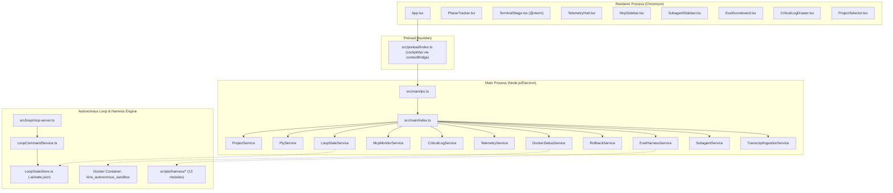
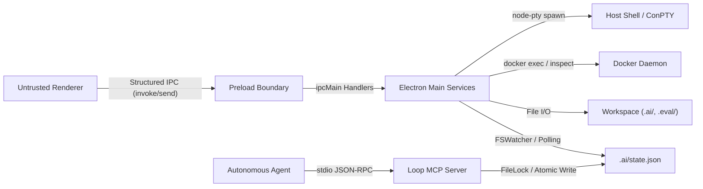

# Kins Multiagents UI Evaluation and Upgrade Blueprint

## Scope and Method

This document provides a comprehensive, evidence-grounded technical evaluation and prioritized upgrade roadmap for `kins-multiagents-ui` (Kins Multi-Agents Cockpit v2.5.1). 

### Method
1. **Symbol & Graph Extraction**: Analyzed 1,279 nodes across 106 indexed files using CodeGraph (`.codegraph/codegraph.db`), covering Electron Main process services, React renderer components, IPC bridge contracts, loop state orchestration, and the evaluation harness.
2. **Layer 1 Architecture Synthesis**: Applied `task-reviewer-prompt.md` and `plan-document-reviewer-prompt.md` via `gpt_architect` to formulate an adversarial evaluation framework and compact test assertions.
3. **Static Audit**: Traced lifecycle, trust boundaries, state synchronization, security sandboxing, and resource management across all primary components.

---

## Current-System Map

The application is structured into four primary subsystems:



### Process Boundaries & File Ownership
- **Main Entry Point**: [`src/main/index.ts`](file:///D:/Workspace/kins-multiagents-ui/src/main/index.ts) manages window creation, service instantiation, lifecycle shutdown, and initial push snapshots.
- **IPC Dispatch**: [`src/main/ipc.ts`](file:///D:/Workspace/kins-multiagents-ui/src/main/ipc.ts) registers bidirectional IPC channels between Electron Main and Renderer.
- **Preload API Contract**: [`src/preload/index.ts`](file:///D:/Workspace/kins-multiagents-ui/src/preload/index.ts) exposes `window.cockpitApi` using `contextBridge.exposeInMainWorld()`.
- **Renderer Root**: [`src/renderer/App.tsx`](file:///D:/Workspace/kins-multiagents-ui/src/renderer/App.tsx) aggregates top-level state and coordinates layout.
- **Loop State Machine**: [`src/loop/LoopCommandService.ts`](file:///D:/Workspace/kins-multiagents-ui/src/loop/LoopCommandService.ts) and [`src/loop/LoopStateStore.ts`](file:///D:/Workspace/kins-multiagents-ui/src/loop/LoopStateStore.ts) implement file-locked state transitions.
- **Evaluation Harness**: 13 autonomous harness modules located in `scripts/harness/` managing anti-gaming checks, AST merging, flakiness detection, network policy, and telemetry.

---

## Trust-Boundary and Data-Flow Model



### Trust Boundary Analysis
1. **Renderer-to-Main IPC**: Untrusted input originating in the Chromium renderer process flows through `src/preload/index.ts` into `src/main/ipc.ts`.
2. **Main-to-Host Shell Boundary**: [`PtyService.ts`](file:///D:/Workspace/kins-multiagents-ui/src/main/services/PtyService.ts) invokes `node-pty.spawn()` with host credentials and inherited environment variables.
3. **Main-to-Docker Boundary**: [`DockerStatusService.ts`](file:///D:/Workspace/kins-multiagents-ui/src/main/services/DockerStatusService.ts) and `scripts/harness/sandbox.mjs` interact with Docker socket/engine.
4. **Agent MCP Boundary**: [`src/loop/mcp-server.ts`](file:///D:/Workspace/kins-multiagents-ui/src/loop/mcp-server.ts) accepts JSON-RPC over stdio and executes phase transitions against `.ai/state.json`.

---

## Findings Register

| ID | Domain | Evidence | Finding or Risk | Impact | Severity | Likelihood | Recommendation | Priority | Effort |
|---|---|---|---|---|---|---|---|---|---|
| **SEC-1** | Security | [`src/main/services/PtyService.ts#L58-L62`](file:///D:/Workspace/kins-multiagents-ui/src/main/services/PtyService.ts#L58-L62) | **Confirmed Finding**: Unrestricted host environment (`process.env`) passed directly into spawned PTY shell without filtering or secret masking. | Leaks sensitive environment variables (API keys, cloud tokens) to any script or subagent running in the terminal. | High | High | Sanitize and allowlist environment variables; redact secrets from terminal buffer. | P0 | S |
| **SEC-2** | Security | [`src/main/index.ts#L74-L79`](file:///D:/Workspace/kins-multiagents-ui/src/main/index.ts#L74-L79) | **Confirmed Finding**: Missing explicit Content Security Policy (CSP) headers in Electron window; no `will-navigate` or `setWindowOpenHandler` restrictions. | Risk of malicious remote content navigation or external script execution if renderer is compromised. | High | Medium | Add strict CSP meta tag in `index.html` and attach `setWindowOpenHandler` returning `{ action: 'deny' }`. | P0 | S |
| **ARCH-1** | Architecture | [`src/main/ipc.ts#L207-L225`](file:///D:/Workspace/kins-multiagents-ui/src/main/ipc.ts#L207-L225) | **Confirmed Finding**: Incomplete IPC handler cleanup in `teardownIpc()`. Handlers `loop:stepForward`, `loop:stepBack`, and `loop:decideGate` are never unregistered. | Duplicate handler errors and memory leaks upon window reload or service restart. | Medium | High | Add explicit `removeHandler` calls for all registered IPC endpoints. | P1 | S |
| **ARCH-2** | Architecture | [`src/main/services/ProjectService.ts#L130-L140`](file:///D:/Workspace/kins-multiagents-ui/src/main/services/ProjectService.ts#L130-L140) | **Confirmed Finding**: Incomplete service re-pointing during project switching. `EvalHarnessService`, `TranscriptIngestionService`, and `DockerStatusService` are not re-pointed to the new project root. | Operations run in the context of the previous workspace; metrics and test runs contaminate other repositories. | High | High | Extend `ProjectScopedServices` interface to include all workspace-dependent services and invoke `setProjectRoot()` deterministically. | P1 | M |
| **ARCH-3** | Architecture | [`src/main/services/LoopStateService.ts#L232`](file:///D:/Workspace/kins-multiagents-ui/src/main/services/LoopStateService.ts#L232) vs [`#L265`](file:///D:/Workspace/kins-multiagents-ui/src/main/services/LoopStateService.ts#L265) | **Confirmed Finding**: Dual-path state modification. `decideGate` instantiates `JsonFileLoopStateStore` with `FileLock`, while `resetLoop` and `advanceToPhase` write directly to disk with raw `fs.writeFileSync`. | Race conditions, lock bypass, and file corruption when human and agent trigger simultaneous updates. | High | Medium | Unify all `.ai/state.json` mutations through a single authoritative `LoopStateStore` instance with write queueing. | P1 | M |
| **PERF-1** | Performance | [`src/renderer/App.tsx#L64-L100`](file:///D:/Workspace/kins-multiagents-ui/src/renderer/App.tsx#L64-L100) | **Confirmed Finding**: Monolithic root state causing full tree re-renders on every high-frequency IPC push (PTY output, log stream, telemetry metrics). | UI frame stutter, high CPU utilization, and input lag in `TerminalStage` during heavy CLI logging. | High | High | Introduce fine-grained state slices (e.g. Zustand or split Contexts) and wrap UI leaf components in `React.memo`. | P1 | M |
| **PERF-2** | Performance | [`src/main/services/PtyService.ts#L75-L82`](file:///D:/Workspace/kins-multiagents-ui/src/main/services/PtyService.ts#L75-L82) | **Confirmed Finding**: Unthrottled PTY chunk dispatching across IPC. Each incoming byte chunk immediately triggers an IPC message without batching or backpressure. | IPC channel saturation and Chromium event-loop blocking when CLI processes dump large text streams. | Medium | High | Buffer and throttle terminal chunks (e.g., 16ms animation frame batching) before dispatching to IPC. | P2 | S |
| **PERF-3** | Performance | [`src/renderer/components/CriticalLogDrawer.tsx`](file:///D:/Workspace/kins-multiagents-ui/src/renderer/components/CriticalLogDrawer.tsx) | **Confirmed Finding**: Non-virtualized log rendering. Full array of log entries rendered directly into DOM. | DOM node explosion and slowdown when log buffer reaches 500+ items. | Medium | Medium | Implement DOM virtualization (windowing) for the critical log entry list. | P2 | M |
| **REL-1** | Reliability | [`src/main/services/DockerStatusService.ts#L48-L68`](file:///D:/Workspace/kins-multiagents-ui/src/main/services/DockerStatusService.ts#L48-L68) | **Confirmed Finding**: Unconditional Docker polling every 3 seconds via child process `docker inspect`. | Generates continuous child-process overhead and log noise when Docker daemon is not running. | Low | High | Implement exponential backoff when daemon connection fails; pause polling if container is absent. | P2 | S |
| **FEAT-1** | Feature | [`src/renderer/components/PhaseTracker.tsx`](file:///D:/Workspace/kins-multiagents-ui/src/renderer/components/PhaseTracker.tsx) | **Recommendation**: Gate actions lack interactive confirmation modal and diff evidence review for `DESTRUCTIVE_ACTION` and `FINAL_RELEASE`. | Human operator might accidentally approve a destructive release without reviewing reality check findings. | Medium | Medium | Add an approval confirmation dialog displaying reality checker findings and diff summary before gate transition. | P2 | M |
| **FEAT-2** | Feature | [`src/renderer/components/TelemetryHud.tsx`](file:///D:/Workspace/kins-multiagents-ui/src/renderer/components/TelemetryHud.tsx) | **Recommendation**: Telemetry HUD lacks session history timeline and cost breakdown by subagent. | Difficult to trace which specific subagent or task consumed excess tokens or budget. | Low | Low | Add multi-agent cost breakdown table and exportable diagnostic JSON. | P3 | M |

---

## Target Architecture

The target architecture establishes clean separation of concerns and single-source-of-truth semantics:

1. **Authoritative State Engine**:
   - All state mutations (`.ai/state.json`) are mediated exclusively through `LoopStateStore` utilizing advisory file locking (`FileLock`) and optimistic concurrency tokens.
   - `LoopStateService` acts as an in-memory cached observer and facade, eliminating duplicate instantiation of stores.
2. **Unified Workspace Service Container**:
   - `ProjectService` acts as the lifecycle root for all workspace-bound services (`PtyService`, `LoopStateService`, `McpMonitorService`, `RollbackService`, `EvalHarnessService`, `TranscriptIngestionService`).
   - Workspace switching is atomic: active processes are cleanly paused or terminated, state stores flushed, and observers reconnected.
3. **Hardened Preload & IPC Boundary**:
   - Every IPC handler validates incoming arguments against runtime schemas.
   - `teardownIpc` guarantees 100% symmetric unregistration of handlers and listeners.
4. **Decoupled Renderer Architecture**:
   - State management transitioned from `App.tsx` local state to isolated selector stores.
   - High-frequency PTY data streams directly to `TerminalStage` without triggering re-renders in `PhaseTracker` or `TelemetryHud`.

---

## Security Upgrade Plan

### 1. Electron Hardening
- **CSP Specification**: Add `<meta http-equiv="Content-Security-Policy" content="default-src 'self'; script-src 'self'; style-src 'self' 'unsafe-inline';">` to `index.html`.
- **Navigation Guard**: Add `mainWindow.webContents.setWindowOpenHandler(() => ({ action: 'deny' }))` and prevent top-level navigation via `will-navigate`.

### 2. PTY Environment Isolation
- Define an allowlist of permitted environment variables in `PtyService.ts`:
  ```typescript
  const ALLOWED_ENV_VARS = [
    'PATH', 'APPDATA', 'LOCALAPPDATA', 'USERPROFILE', 'HOME',
    'SHELL', 'COMSPEC', 'TERM', 'COLORTERM', 'LANG'
  ];
  ```
- Strip any token/secret patterns (`*_KEY`, `*_SECRET`, `*_TOKEN`) from inherited shell context unless explicitly bound to the workspace.

### 3. IPC Schema Validation
- Validate all payloads in `src/main/ipc.ts` using strict type guards before delegating to backend services.

---

## Performance Upgrade Plan

### 1. PTY Batching & Backpressure
- In `PtyService.ts`, accumulate incoming stdout chunks into a micro-buffer and flush to IPC every 16ms (60 FPS throttle) or when the buffer exceeds 4KB:
  ```typescript
  private flushBuffer(): void {
    if (this.pendingChunks.length > 0) {
      const batched = this.pendingChunks.join("");
      this.pendingChunks = [];
      this.emitData(batched);
    }
  }
  ```

### 2. State Slice Decomposition (React Rerender Optimization)
- Split monolithic root state in `App.tsx` into independent context slices:
  - `TerminalState` (PTY status, size)
  - `LoopState` (Phase, budget, gate status)
  - `TelemetryState` (Tokens, USD cost)
  - `EvalState` (Scores, benchmark reports)
- Apply `React.memo` to `TerminalStage`, `TelemetryHud`, `PhaseTracker`, `McpSidebar`, and `EvalScoreboard`.

---

## Reliability and Observability Plan

### 1. Graceful Docker Degradation
- In `DockerStatusService.ts`, implement adaptive polling:
  - Default: 3,000ms.
  - When Docker daemon is offline / unreachable: back off to 15,000ms.
  - Reset to 3,000ms immediately upon successful connection.

### 2. Correlated Diagnostic Logging
- Extend `CriticalLogService.ts` and `TelemetryService.ts` with a unified `runId` and `timestamp` correlation ID to trace agent tool invocations, shell commands, and evaluation score changes across time.

---

## Feature Roadmap

### Milestone 1: Core Integrity & Hardening (P0 / P1)
- [ ] Implement CSP headers and Electron navigation lockdown.
- [ ] Sanitize environment variables passed to `PtyService`.
- [ ] Fix IPC unregistration leaks in `src/main/ipc.ts`.
- [ ] Unify `.ai/state.json` mutations through `LoopStateStore`.
- [ ] Bind `EvalHarnessService` and `TranscriptIngestionService` to `ProjectService.switchProject`.

### Milestone 2: Performance & Scalability (P1 / P2)
- [ ] Add 16ms buffer batching to `PtyService` output streaming.
- [ ] Decouple root state in `App.tsx` with component memoization.
- [ ] Add virtualized list rendering to `CriticalLogDrawer`.
- [ ] Implement exponential backoff in `DockerStatusService`.

### Milestone 3: Operational Ergonomics (P2 / P3)
- [ ] Add interactive Gate Decision confirmation modal with diff and reality check summary.
- [ ] Display subagent token and cost breakdown in `TelemetryHud`.
- [ ] Support one-click diagnostic report export (sanitized JSON).

---

## Phased Implementation Plan

### Phase 1: Security & IPC Sanitization (Sprint 1)
- **Scope**: `src/main/index.ts`, `src/main/ipc.ts`, `src/main/services/PtyService.ts`.
- **Deliverables**: Hardened window preferences, complete IPC cleanup, scrubbed PTY environment.
- **Verification**: Unit tests for IPC handler registration/unregistration; validation that sensitive host env vars are absent from PTY.

### Phase 2: State Machine Unification & Project Scoping (Sprint 2)
- **Scope**: `src/main/services/LoopStateService.ts`, `src/main/services/ProjectService.ts`, `src/loop/LoopCommandService.ts`.
- **Deliverables**: Single-store architecture with advisory file locks, full workspace switching for all 6 dependent services.
- **Verification**: Concurrency stress tests with simultaneous gate decisions and loop step actions.

### Phase 3: Renderer Optimization & Telemetry Timeline (Sprint 3)
- **Scope**: `src/renderer/App.tsx`, `src/renderer/components/*`.
- **Deliverables**: Split contexts, memoized panels, PTY batching, interactive gate modals.
- **Verification**: UI frame rate profiling during 1,000 lines/sec terminal output.

---

## Verification Strategy

All proposed upgrades must be validated against deterministic criteria:
1. **Zero Runtime Token Cost ($0)**: All automated tests execute locally via Node test runner / Vitest.
2. **Specification Integrity**: The directory `.eval/` remains untouched throughout all upgrades.
3. **Automated Assertion Suite**:
   - IPC leak test: Verify registering and unregistering IPC handlers leaves zero listeners.
   - Project switch test: Verify switching project root repoints all 6 services without leftover state.
   - PTY env test: Verify child process environment contains only allowlisted keys.
   - State concurrency test: Verify concurrent file lock acquisitions do not corrupt `state.json`.

---

## Migration and Rollback

### Migration Procedure
1. Create isolated Git worktree: `git worktree add .worktrees/upgrade-phase-1 -b upgrade/hardening`.
2. Apply changes incrementally per sprint phase.
3. Run test suite: `npm test`.
4. Validate Electron dev build: `npm run build && npm run app:start`.

### Rollback Strategy
- All changes are backwards-compatible with `.ai/state.json` schema version 1.
- If any service fails during runtime initialization, `ProjectService` falls back gracefully to default workspace roots.
- Git worktree isolation ensures `main` branch is untouched until final user sign-off.

---

## Open Questions

1. **Docker Desktop on Windows**: Should the cockpit provide an in-app toggle to automatically spin up `kins_autonomous_sandbox` via Docker CLI when Docker Desktop is detected?
2. **Subagent Execution Model**: How should subagent activities spawned via `invoke_subagent` be correlated with the Cockpit PTY terminal output?
3. **CodeGraph Daemon Integration**: Should the Cockpit expose a dedicated CodeGraph status indicator showing SQLite database sync state and symbol index freshness?

---

## Evidence Index

Sorted lexicographically by file path and symbol:

- `docs/LOOP.md` — Section 2.1 (Hard Execution Constants), Section 2.2 (Canonical Enumerations), Section 3 (Pillars).
- `package.json` — Dependencies (`electron@34`, `react@19`, `node-pty@1.1.0`, `@xterm/xterm@5.5.0`).
- `src/loop/LoopCommandService.ts` — Class `LoopCommandService`, Method `transition`, Array `CANONICAL_PHASES`.
- `src/loop/LoopStateStore.ts` — Class `JsonFileLoopStateStore`, Class `FileLock`.
- `src/loop/mcp-server.ts` — Function `startMcpStdioServer`, Function `handleJsonRpcMessage`.
- `src/main/index.ts` — Function `createWindow`, Method `mainWindow.loadURL`, App lifecycle hooks `before-quit`.
- `src/main/ipc.ts` — Function `registerIpcHandlers`, Interface `ServiceContainer`.
- `src/main/services/CriticalLogService.ts` — Class `CriticalLogService`, Method `classifyLogLine`.
- `src/main/services/DockerStatusService.ts` — Class `DockerStatusService`, Method `mapDockerState`.
- `src/main/services/EvalHarnessService.ts` — Class `EvalHarnessService`, Method `runBenchmark`.
- `src/main/services/LoopStateService.ts` — Class `LoopStateService`, Method `decideGate`, Method `resetLoop`.
- `src/main/services/McpMonitorService.ts` — Class `McpMonitorService`, Method `getSnapshot`.
- `src/main/services/ProjectService.ts` — Class `ProjectService`, Method `switchProject`, Interface `ProjectScopedServices`.
- `src/main/services/PtyService.ts` — Class `PtyService`, Method `start`, Property `ptyProcess`.
- `src/main/services/RollbackService.ts` — Class `RollbackService`, Method `executeRollback`.
- `src/main/services/SandboxLifecycleService.ts` — Class `SandboxLifecycleService`.
- `src/main/services/SubagentService.ts` — Class `SubagentService`, Method `normalizePromptSummary`.
- `src/main/services/TelemetryService.ts` — Class `TelemetryService`, Method `calculateEstimatedCostUsd`.
- `src/main/services/TranscriptIngestionService.ts` — Class `TranscriptIngestionService`, Method `detectPhaseWithEvidenceFromTranscriptStep`.
- `src/preload/index.ts` — Object `cockpitApi`, Function `contextBridge.exposeInMainWorld`.
- `src/renderer/App.tsx` — Component `App`, State `loopState`, Subscriptions `useEffect`.
- `src/renderer/components/CriticalLogDrawer.tsx` — Component `CriticalLogDrawer`.
- `src/renderer/components/EvalScoreboard.tsx` — Component `EvalScoreboard`.
- `src/renderer/components/McpSidebar.tsx` — Component `McpSidebar`.
- `src/renderer/components/PhaseTracker.tsx` — Component `PhaseTracker`.
- `src/renderer/components/ProjectSelector.tsx` — Component `ProjectSelector`.
- `src/renderer/components/SubagentSidebar.tsx` — Component `SubagentSidebar`.
- `src/renderer/components/TelemetryHud.tsx` — Component `TelemetryHud`.
- `src/renderer/components/TerminalStage.tsx` — Component `TerminalStage`.
- `src/shared/contracts.ts` — Interfaces `CockpitApi`, `LoopStateSnapshot`, `TelemetrySnapshot`.
