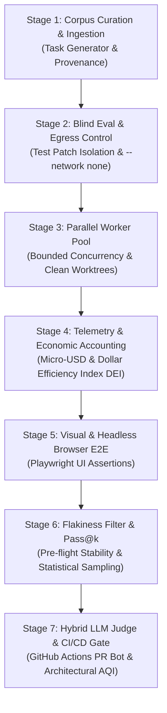

# Enterprise Autonomous Agent Evaluation Harness Evolution Plan & Market Audit

> **Normative Blueprint & Operational Roadmap (v3.0)**
> - **Reviewed by:** Layer 1 GPT Prompt Architect & Layer 2 Gemini 3.8 Flash
> - **Target Standards:** SWE-bench Verified, METR Task Harness, Inspect AI (UK AISI)
> - **Applicable Skills:** `superpowers:subagent-driven-development`, `superpowers:executing-plans`
> - **Invariants:** `.eval/` immutability, zero-token CPU execution, fail-closed isolation, Karpathy simplicity-first.

---

## 1. Executive Summary & Market-Readiness Audit

### A. Is This Harness Ready to Stand on the Market?
**Layer 1 GPT Architect Verdict:**
Adding the 5 missing pillars (Corpus Management, Parallel Workers, Network Egress Control, Telemetry/DEI Economics, and CI/CD Gates) elevates `kins-eval-harness` from a local test runner to an **industry-competitive, audit-ready benchmarking engine**. 

However, to claim **"Audit-Proof Enterprise Benchmark"** parity with SWE-bench and METR, the harness must eliminate subtle failure modes:
1. **Provenance & Anti-Contamination:** Benchmark tasks cannot be unvetted or automatically promoted into `.eval/`. A trusted curation boundary with candidate staging (`.harness/corpus-staging/`) and human promotion is mandatory.
2. **Fail-Closed Networking:** Unknown network configurations must strictly resolve to `--network none`. Allowlist proxying must defend against DNS rebinding, internal IP traversal, and credential leakage.
3. **Integer Economic Accounting:** Token billing and Dollar Efficiency Index (DEI) must use integer micro-USD arithmetic and immutable pricing catalog versions, never floating-point estimations.
4. **Isolated Fork Security in CI/CD:** Untrusted PRs must run in secret-free sandboxes via `pull_request` (never `pull_request_target`).

```text
Trusted Curator Plane
  Git Commits/Issues -> Candidate Ingestion -> F2P/P2P Verification -> Staging -> Human Promotion Gate (.eval/)
Untrusted Execution Plane
  Public Task Manifests -> Bounded Worker Pool -> Detached Worktree -> Hermetic Container (--network none) -> Anti-Gaming
Control & Evidence Plane
  Provider Telemetry -> Integer Micro-USD -> DEI Metric -> Hash-Linked Audit Stream -> CI/CD Regression Gate
```

---

## 2. Summary of Work Completed in Prior Sessions (v2.3.0)

1. **Untracked Files Anti-Gaming Protection** ([`scripts/harness/anti-gaming.mjs`](file:///D:/Workspace/kins-multiagents-ui/scripts/harness/anti-gaming.mjs)):
   - NUL-delimited untracked file discovery via `git ls-files --others --exclude-standard -z`.
   - Any untracked addition under `.eval/` or protected test configs immediately triggers `FORBIDDEN_FILE_MODIFIED`.
2. **Fail-Closed Strict Isolation** ([`scripts/harness/sandbox.mjs`](file:///D:/Workspace/kins-multiagents-ui/scripts/harness/sandbox.mjs)):
   - Added `strictIsolation: boolean` to `SandboxOptions`. When Docker is offline, throws an explicit exception rather than falling back to host execution.
3. **Runner Ephemeral Sandbox Lifecycle** ([`scripts/harness/runner.mjs`](file:///D:/Workspace/kins-multiagents-ui/scripts/harness/runner.mjs)):
   - Single-task sandbox execution with automatic teardown in `finally`.
4. **AST 3-Way Worktree Merger** ([`scripts/harness/ast-merger.mjs`](file:///D:/Workspace/kins-multiagents-ui/scripts/harness/ast-merger.mjs)):
   - Semantic code merging across parallel agent branches without text git conflicts.
5. **Cockpit UI Eval HUD** ([`src/renderer/components/EvalScoreboard.tsx`](file:///D:/Workspace/kins-multiagents-ui/src/renderer/components/EvalScoreboard.tsx), [`src/main/services/EvalHarnessService.ts`](file:///D:/Workspace/kins-multiagents-ui/src/main/services/EvalHarnessService.ts)):
   - Dark-console dashboard with Pass@1, SSI, live status badges, and empty-state resilience.

---

## 3. The 7-Stage Comprehensive Enterprise Evolution Roadmap



---

### Stage 1: Dataset Corpus Management & Task Ingestion Engine
**Goal:** Automate the generation, extraction, and provenance verification of benchmark tasks from Git commits and issues without risking test contamination.
- [x] Implement `scripts/harness/corpus.mjs` and CLI `scripts/harness/corpus-cli.mjs`:
  - `kins-harness corpus ingest --repo <url> --base <sha> --target <sha>`
  - `kins-harness corpus validate <taskId>`
  - `kins-harness corpus verify <corpusDir>`
- [x] Define canonical `TaskManifest` JSON schema with full commit SHAs, author provenance, license metadata, and artifact content digests.
- [x] Automatically verify candidate tasks: F2P assertions must fail on `baseCommit` and pass on `targetCommit`; P2P assertions must pass on both.
- [x] Establish staging boundary: Candidates write to `.harness/corpus-staging/`; promotion to `.eval/` requires explicit human sign-off.

---

### Stage 2: Test Patch Isolation & Hermetic Network Egress Control
**Goal:** Prevent agents from reading withheld tests or fetching solutions/commits via the internet during benchmark evaluation.
- [x] **Blind Evaluation:** Move golden test assertions into external secure patches (`.ai/secure-patches/`). The runner injects them into the ephemeral container only during verifier execution and purges them immediately.
- [x] **Default Air-Gap:** Enforce `networkPolicy: { mode: "none" }` by default (`--network none` in Docker).
- [x] **Hardened Docker Boundary:** Add `--cap-drop ALL`, `--security-opt no-new-privileges`, `--memory 4g`, `--cpus 2`, and `--pids-limit 256` to container creation.
- [x] **Audited Proxy (Optional Allowlist):** When dependencies must be resolved, route all traffic through an audited proxy with DNS rebinding defenses, loopback/private-IP blocking, and request redaction.


---

### Stage 3: Parallel Worker Pool & Ephemeral Container Orchestration
**Goal:** Replace the sequential task loop with a bounded, concurrent worker pool capable of running 50–100 benchmark tasks across parallel containers.
- [x] Implement `scripts/harness/worker-pool.mjs`:
  - `runTaskPool(tasks, { concurrency: N, taskTimeoutMs, networkPolicy, abortSignal })`
- [x] Allocate independent detached Git worktrees, isolated containers, and output directories per worker attempt.
- [x] Guarantee deterministic output ordering in `BatchEvaluationReport` regardless of completion order.
- [x] Graceful cancellation: Handle `SIGINT` / UI cancel by immediately terminating active containers and unmounting temporary worktrees in `finally` blocks.
- [x] Distinguish harness infrastructure failure (e.g. Docker daemon crash) from task failure.


---

### Stage 4: Granular Telemetry, Token Economics & Dollar Efficiency Index (DEI)
**Goal:** Attribute precise token consumption and dollar expenditure per task, preventing floating-point accounting drift.
- [x] Implement `scripts/harness/telemetry.mjs` capturing provider-level token usage (Prompt, Completion, Cache Read, Cache Write).
- [x] Establish versioned pricing catalog `scripts/harness/pricing/catalog.json` with micro-USD rates.
- [x] Implement integer micro-USD cost arithmetic:
  $$\text{Total Cost} = \text{Input Cost} + \text{Output Cost} + \text{Cache Cost}$$
- [x] Calculate **Dollar Efficiency Index (DEI)**:
  $$\text{DEI} = \frac{\text{Weighted Passed Tasks}}{\text{Total Cost in USD}}$$
  *(If cost is 0, DEI resolves to `null` to avoid division-by-zero).*
- [x] Generate append-only, sequence-numbered, hash-linked event stream for tamper-evident audit trails.

---

### Stage 5: Visual & Headless Browser E2E UI Assertions
**Goal:** Enable the harness to verify Frontend and Electron UI components without human intervention.
- [x] Add Playwright / Chromium headless support into `scripts/harness/sandbox.mjs`.
- [x] Implement DOM snapshot assertions and visual regression diffing helpers in `scripts/harness/visual.mjs`.
- [x] Create benchmark tasks for Kins Cockpit (e.g. testing active tab switching, terminal panel resizing, and scoreboard telemetry rendering).

---

### Stage 6: Flakiness Filter & Pass@k Statistical Sampling
**Goal:** Eliminate false negatives caused by race conditions, I/O timeouts, or model non-determinism.
- [x] Implement pre-flight flakiness detector in `scripts/harness/runner.mjs`: execute baseline tests 3 times on `baseCommit`; if outcomes fluctuate, flag task as `FLAKY_TEST` and exclude from penalty.
- [x] Support `passAtK` statistical sampling ($k=1, 3, 5$) to measure model confidence distributions across repeated attempts.
- [x] Add jitter and CPU stress injection to verify test resilience under heavy load.

---

### Stage 7: Hybrid LLM-as-a-Judge & Continuous CI/CD PR Gates
**Goal:** Enforce quality gates in pull requests and evaluate qualitative architectural compliance ($0 CPU test pass + LLM style review).
- [x] Implement `scripts/harness/ci-report.mjs` to compare baseline and candidate benchmark reports:
  - Gate criteria: Pass@1 floor, maximum SSI regression, zero anti-gaming violations.
  - Incomparable detection: Flags version mismatches in dataset schema or pricing catalog.
- [x] Create `.github/workflows/eval-harness.yml`:
  - Pinned actions by commit SHA.
  - Use `pull_request` with secret isolation for untrusted community forks.
  - Post idempotent markdown scorecard comment on PRs.
- [x] Implement Layer 1 LLM-as-a-Judge rubric: Modularity, maintainability, minimal surgical diff compliance, and Architecture Quality Index (AQI 1–5).

---

## 4. Shared Contract Extensions (`src/shared/harness.ts`)

```ts
export type NetworkPolicy =
  | { readonly mode: "none" }
  | { readonly mode: "allowlist"; readonly proxyUrl: string; readonly allowedHosts: readonly string[] };

export interface DatasetVersion {
  readonly datasetId: string;
  readonly version: string;
  readonly manifestSha256: string;
  readonly createdAt: string;
}

export interface TaskProvenance {
  readonly repositoryUrl: string;
  readonly baseCommit: string;
  readonly targetCommit: string;
  readonly sourceType: "commit" | "issue";
  readonly sourceId: string;
  readonly license: string;
}

export interface TokenUsage {
  readonly promptTokens: number;
  readonly completionTokens: number;
  readonly cacheReadTokens: number;
  readonly cacheWriteTokens: number;
  readonly source: "provider" | "gateway" | "unavailable";
}

export interface CostAttribution {
  readonly pricingCatalogVersion: string;
  readonly currency: "USD";
  readonly totalMicroUsd: number;
}

export interface WorkerAttempt {
  readonly runId: string;
  readonly taskId: string;
  readonly attempt: number;
  readonly workerId: string;
  readonly containerId: string;
  readonly tokenUsage: TokenUsage;
  readonly cost: CostAttribution | null;
}

export interface BatchEvaluationReport {
  readonly dataset: DatasetVersion;
  readonly attempts: readonly WorkerAttempt[];
  readonly taskReports: readonly EvaluationReport[];
  readonly weightedPassed: number;
  readonly totalCostMicroUsd: number;
  readonly dollarEfficiencyIndex: number | null;
  readonly auditDigest: string;
}
```

---

## 5. Verification Protocol & Compact Test Assertions

Run all verification inside the container `kins_autonomous_sandbox`:
```bash
docker exec kins_autonomous_sandbox sh -lc 'npm run lint --if-present && npm run typecheck --if-present && npm test'
```

### Compact Assertions Table (Anti-Hallucination Gate)
| Input Scenario | Expected Deterministic Output |
| :--- | :--- |
| `100 tasks, concurrency=8` | Peak active containers $\le 8$; report preserves input task order |
| `sandbox policy=none; HTTPS probe` | Outbound socket rejected immediately; attempt logged in audit trail |
| `passedWeight=4; cost=2,000,000 microUSD` | $\text{DEI} = 2.0$ |
| `Same candidate task ingested twice` | Identical canonical `TaskManifest` SHA-256 digest |
| `Candidate PR with Pass@1 regression` | CI check fails with exit code 1 and blocks merge |
| `Attempted write into .eval/` | Immediate `FAILED: SPECIFICATION_INTEGRITY` termination |

---

## 6. Key Reference Files
- Evaluation Runner: [`scripts/harness/runner.mjs`](file:///D:/Workspace/kins-multiagents-ui/scripts/harness/runner.mjs)
- Anti-Gaming Engine: [`scripts/harness/anti-gaming.mjs`](file:///D:/Workspace/kins-multiagents-ui/scripts/harness/anti-gaming.mjs)
- Ephemeral Sandbox Engine: [`scripts/harness/sandbox.mjs`](file:///D:/Workspace/kins-multiagents-ui/scripts/harness/sandbox.mjs)
- AST Code Merger: [`scripts/harness/ast-merger.mjs`](file:///D:/Workspace/kins-multiagents-ui/scripts/harness/ast-merger.mjs)
- Autonomous Loop Spec: [`docs/LOOP.md`](file:///D:/Workspace/kins-multiagents-ui/docs/LOOP.md)
- Operating Guidelines: [`AGENTS.md`](file:///D:/Workspace/kins-multiagents-ui/AGENTS.md)

