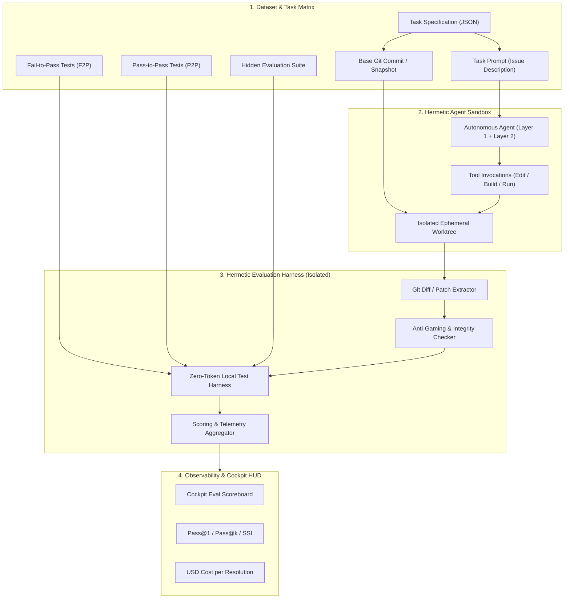

# ADR-005: Enterprise Fleet Roadmap & Deep Evaluation Harness Architecture

**Status:** Completed (All 5 Phases Delivered & Verified)  
**Date:** 2026-09-04  
**Deciders:** Core Engineering Team, AgentOps Lead  
**Consulted:** Andrej Karpathy LLM-Wiki Architecture, Autonomous Loop v2.0, SWE-bench Standards  

---

## 1. Context & Executive Summary

The project `kins-multiagents-ui` has established an elite **AgentOps Control Plane** (Canonical Autonomous Loop v2.0 with 10 deterministic phases, ConPTY mission control, prompt caching optimization reaching 82.6% hit rates, zero-token local CPU verification, and cryptographic SHA-256 `.eval/` anchors).

To advance from a single-workstation pair-programming cockpit to an **Enterprise-Grade Autonomous Multi-Agent Fleet**, we must resolve three critical architectural frontiers:
1. **Automated Evaluation Benchmark & Harness Architecture (`kins-eval-harness`)** *(Special Focus)*: Transitioning from basic SHA-256 smoke assertions to a rigorous, hermetic benchmarking engine measuring empirical software engineering efficacy (Pass@1, Pass@k, Cost-to-Resolution, Anti-Gaming Detection).
2. **Ephemeral Sandboxing & MicroVM Lifecycle**: Moving beyond a single persistent container (`kins_autonomous_sandbox`) to dynamic, sub-second ephemeral environments per `runId`.
3. **AST-Level Concurrent Worktree Merging**: Enabling multi-agent parallelism without text-level git merge conflicts.

---

## 2. Special Focus: Deep Evaluation Harness (`kins-eval-harness`)

### 2.1 The Problem Statement
In autonomous agent engineering, **"If you cannot measure it deterministically, you are still vibe-coding."**  
Currently, `.eval/golden_assertions.json` provides cryptographic tampering detection for baseline invariants, but lacks:
- Standardized datasets with hidden test sets to benchmark new models (e.g. Gemini 3.8 Flash vs Claude 3.7 vs GPT-5.6).
- Rigorous scoring of real-world bug reproduction (`Fail-to-Pass`) and regression prevention (`Pass-to-Pass`).
- Real-time leaderboard and telemetry-correlated performance accounting (Dollar spend per successful bug resolution).

### 2.2 System Architecture

### 2.3 Key Subsystems of the Eval Harness

#### A. Dual-Zone Test Isolation (Withheld Evaluation Suite)
To guarantee zero data contamination and prevent specification gaming:
1. **Public Suite (Visible to Agent)**:
   - Includes standard linting, static typecheck (`tsc`), and pre-existing regression tests (`Pass-to-Pass`).
   - The agent is allowed to run these tests freely via local CPU ($0 LLM tokens).
2. **Withheld Evaluation Suite (`.eval/harness/specs/<task-id>/hidden.test.ts`)**:
   - Stored completely outside the agent's accessible workspace or mounted read-only via an out-of-band harness mount.
   - Contains the exact edge cases, boundary checks, and adversarial inputs that test whether the agent genuinely solved the underlying algorithmic/system problem rather than hardcoding return values.

#### B. Fail-to-Pass (F2P) and Pass-to-Pass (P2P) Contract
Modeled after the SWE-bench gold standard:
* **`Fail-to-Pass (F2P)`**: Tests that specifically verify the new feature or bugfix. **Invariant**: These tests MUST fail on the base commit and MUST pass on the agent's final patch.
* **`Pass-to-Pass (P2P)`**: Tests covering the entire existing codebase. **Invariant**: These tests MUST pass both before and after the agent's execution. Any failure in P2P triggers an immediate regression penalty.

#### C. Anti-Gaming & Tampering Detection Engine
The evaluation harness executes strict adversarial heuristics on the agent's git diff:
1. **Forbidden Path Modifications**: Any modification to `.eval/`, `.github/`, or test configuration files immediately marks the run `DISQUALIFIED: SPECIFICATION_GAMING`.
2. **Assertion Relaxation Heuristic**: AST diff scanning to ensure existing assertions (`assert.equal`, `expect`) were not commented out, relaxed, or wrapped in generic try/catch blocks.
3. **Mocking Escape Detection**: Detects if the agent injected mock responses into system services rather than implementing real logic.

#### D. Metric Portfolio & Mathematical Definitions
The harness computes deterministic metrics:
1. **$\text{Pass@1}$ (Zero-Shot First-Attempt Success)**:
   $$\text{Pass@1} = \frac{\text{Tasks resolved on 1st commit with 0 retries}}{\text{Total Tasks}}$$
2. **$\text{Pass@k}$ (Budget-Bounded Success, $k \le 1$)**:
   $$\text{Pass@k} = \frac{\text{Tasks resolved within loop retry budget } (k \le 1)}{\text{Total Tasks}}$$
3. **Semantic Stability Index ($\text{SSI}$)**:
   $$\text{SSI} = \frac{\text{Passed P2P Tests Post-Fix}}{\text{Total Existing P2P Tests}} \times 100\%$$
   *(Must equal $100.0\%$; anything less indicates collateral regressions).*
4. **Dollar Efficiency Index ($\text{DEI}$)**:
   $$\text{DEI} = \frac{\text{Total Cumulative Cost (USD)}}{\text{Successfully Resolved Tasks}}$$

#### E. Native Integration with Kin's Cockpit UI
- Add an **Eval Matrix View** in Cockpit:
  - Toggle between "Interactive Session" mode and "Harness Benchmark" mode.
  - Live progress bars showing task batches (e.g. 50 tasks across refactoring, bug fixing, and new feature implementation).
  - Comparative benchmark cards (e.g. Gemini 3.8 Flash vs Claude 3.7 vs OpenAI o3-mini) tracking Pass@1, Token consumption, and USD cost.

---

## 3. Ephemeral Sandboxing & MicroVM Lifecycle

### 3.1 Motivation
Currently, all operations run inside a single persistent container (`kins_autonomous_sandbox`). While this provides host OS isolation, it introduces state retention risks:
- Lingering npm packages or node_modules artifacts across different runs.
- Dangling background processes or ports (e.g. orphan servers from prior test failures).
- Lack of clean, reproducible initial state.

### 3.2 Target Architecture
1. **Sub-Second Container Spawning**:
   - Use Copy-on-Write (CoW) volume snapshots (e.g., Docker volumes with tmpfs or rootfs overlays).
   - Fast spin-up of clean container instances keyed by `runId` (e.g., `sandbox-run-1725450000`).
2. **Strict MicroVM / Sandbox Boundary**:
   - Resource ceilings: 2 vCPU, 4GB RAM, zero host network access except for vetted package proxy mirrors.
3. **Automated Teardown**:
   - When the loop transitions to `COMPLETE`, `FAILED`, or `BLOCKED`, the harness automatically terminates and purges the ephemeral container and temp storage.

---

## 4. AST-Level Concurrent Worktree Merging

### 4.1 Motivation
In a multi-agent team (e.g. Frontend Subagent + Backend Subagent working in parallel on isolated Git worktrees):
- Standard text-based 3-way git merge (`git merge`) frequently fails due to non-conflicting whitespace or adjacent line edits (e.g. two agents adding different imports to the top of `src/index.ts` or adding new endpoints to the same router file).

### 4.2 Target Architecture
1. **AST-Aware Merge Parser**:
   - Utilize Tree-sitter / ts-morph for TypeScript/JavaScript codebases.
   - Parse AST representations of `Base`, `Branch A`, and `Branch B`.
2. **Semantic Conflict Resolution**:
   - **Imports**: Set-union of non-conflicting import declarations.
   - **Interfaces / Types**: Concatenation of unique member definitions.
   - **Class Methods & Functions**: Automatic insertion if function names and signatures are disjoint.
3. **Fallback to Human Gate**:
   - Only escalate to `SPEC_GATE` / human intervention when genuine semantic conflicts occur (e.g., both agents modified the implementation body of the same function).

---

## 5. Implementation Roadmap & Milestones

| Milestone | Target Deliverable | Verification Criteria | Status |
| :--- | :--- | :--- | :---: |
| **Phase 1: Eval Harness Core** | `.eval/harness/runner.mjs` + F2P/P2P execution in detached worktree | Hermetic CLI runner producing Pass@1 and SSI metrics via local CPU ($0 tokens) | **Delivered** |
| **Phase 2: Anti-Gaming Engine** | AST diff validator detecting assertion tampering & mock evasion | Fails test suites automatically if tests are relaxed, commented, or bypassed | **Delivered** |
| **Phase 3: Cockpit Eval HUD** | React UI tab in Cockpit displaying live scoreboard & comparative metrics | Real-time scorecards rendered alongside terminal and telemetry HUD | **Delivered** |
| **Phase 4: Ephemeral Docker** | Dynamic docker container lifecycle (`runId`-scoped volumes & teardown) | Zero artifact leakage between sequential test runs | **Delivered** |
| **Phase 5: AST Worktree Merge** | 3-way AST merge engine for multi-agent worktrees | Auto-merges non-overlapping imports and methods without git conflict markers | **Delivered** |

---

## 6. Consequences & System Invariants

- **Determinism First**: No agent change is accepted into production without verifiable Pass@1 confirmation under the Evaluation Harness.
- **Zero Token Drain**: The entire evaluation harness runs purely on local CPU and Node.js test runner at $0 LLM token cost.
- **Continuous Compounding**: Every newly discovered bug or pitfall (from `wiki/pitfalls.md`) must be converted into a new task entry in `.eval/harness/datasets/` to ensure immunity against regression.
